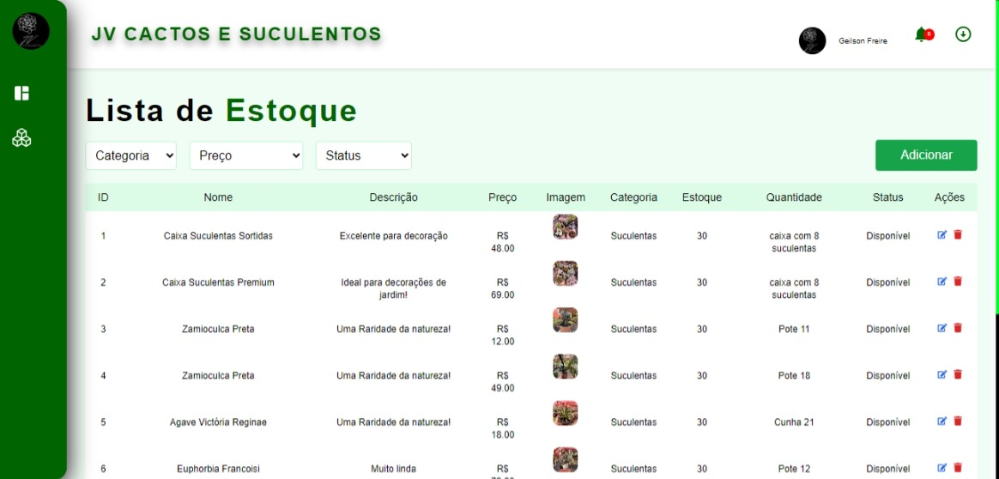
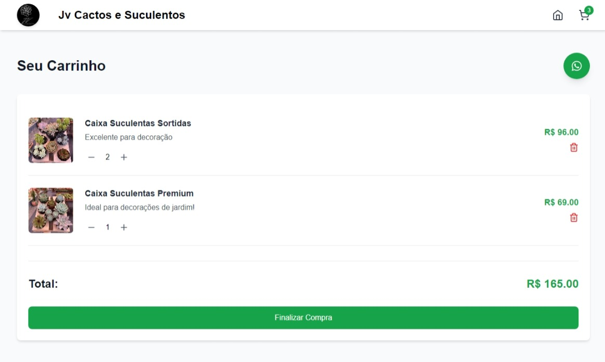
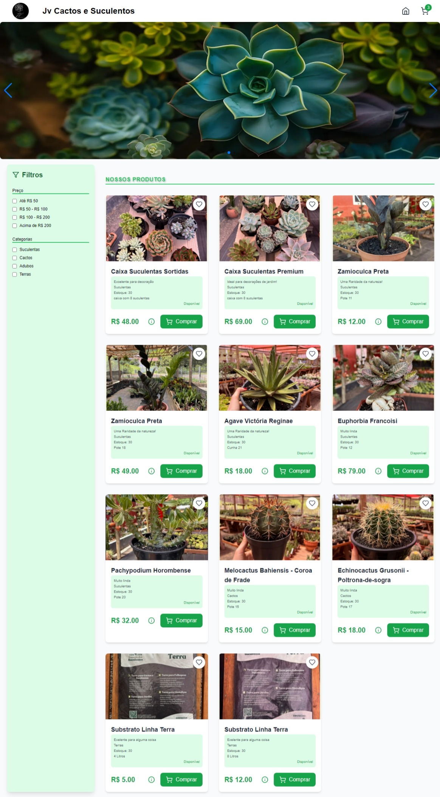

# Front-End Loja Floricultura

Bem-vindo ao projeto Front-End Loja Floricultura! Este projeto é uma aplicação web desenvolvida para uma loja de floricultura, onde os usuários podem visualizar e comprar diversos produtos como suculentas, cactos, adubos e terras.

## Funcionalidades

- Visualização de produtos com detalhes como nome, descrição, preço, imagem, categoria, estoque, status e quantidade.
- Filtros para facilitar a busca por produtos específicos.
- Adição de produtos ao carrinho de compras.
- Visualização do carrinho de compras com a possibilidade de alterar a quantidade de itens e remover itens.
- Finalização de compra.
- Contato via WhatsApp para tirar dúvidas sobre os produtos.

## Tecnologias Utilizadas

- React
- Axios
- Tailwind CSS
- React Router
- React Icons
- Lucide React
- Express
- Multer
- Node.js

## Estrutura do Projeto

A estrutura do projeto é organizada da seguinte forma:

```
public/
|-- logo.webp
src/
|-- admin/
|   |-- painel-componentes/
|       |-- ProductModal.jsx
|   |-- painel-pages/
|       |-- Estoque.jsx
|-- assets/
|   |-- img/
|       |-- Products/
|       |-- Readme/
|-- components/
|   |-- Carousel.jsx
|   |-- ProductCard.jsx
|   |-- Sidebar.jsx
|-- context/
|-- data/
|   |-- ProductStock.json
|-- pages/
|   |-- Cart.jsx
|   |-- Home.jsx
|-- routes/
|-- store/
|   |-- cartStore.js
|-- style/
|-- App.jsx
|-- index.css
|-- main.jsx
.gitignore
index.html
package.json
postcss.config.js
Readme.md
server.js
tailwind.config.js
vite.config.js
```

## Imagens do Projeto






## Como Executar o Projeto

1. Clone o repositório:
   ```bash
   git clone https://github.com/seu-usuario/Front-End_LojaFlorecultura.git
   ```

2. Navegue até o diretório do projeto:
   ```bash
   cd Front-End_LojaFlorecultura
   ```

3. Instale as dependências:
   ```bash
   npm install
   ```

4. Inicie o servidor:
   ```bash
   npm start
   ```

5. Acesse a aplicação no navegador:
   ```
   http://localhost:3000
   ```

## Contato

Para mais informações, entre em contato pelo WhatsApp clicando no ícone na página do carrinho de compras.

---
````
